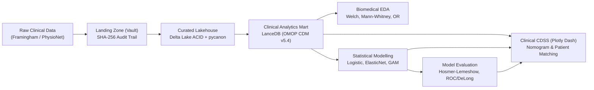

# Hệ Thống Quản Trị Dữ Liệu Y Sinh & Mô Hình Hóa Thống Kê Dự Báo Nguy Cơ Biến Cố Lâm Sàng

> **Học phần:** IT5425 - Quản trị Dữ liệu và Trực quan hóa  
> **Đơn vị:** Trường Công nghệ Thông tin và Truyền thông – Đại học Bách khoa Hà Nội  
> **Nhóm thực hiện:** Nhóm Nghiên cứu Y sinh (Biomedicine Research Group) — 06 thành viên  
> **Đề tài chính thức:** *Statistical modelling in biomedicine, models, methods, and prediction; test statistics, goodness of fit test, model evaluation, ROC curve.*

---

## 🏛️ Kiến Trúc Hệ Thống (Clinical Data Lakehouse)



Hệ thống kết hợp ba trụ cột kỹ thuật:
1. **Lưu trữ giao dịch ACID Delta Lake:** Đảm bảo toàn vẹn dữ liệu lâm sàng theo chuẩn FDA 21 CFR Part 11 và HIPAA Time-Travel audit trails.
2. **Cơ sở dữ liệu đa thể thức LanceDB:** Lưu trữ bảng chuẩn OMOP CDM v5.4, tích hợp Zero-Copy Apache Arrow với Polars và chỉ mục véc-tơ phục vụ tìm kiếm bệnh nhân tương đồng (Patient Similarity Search qua $k$-NN).
3. **Ứng dụng hỗ trợ quyết định lâm sàng (Plotly Dash CDSS):** Giao diện tương tác phản ứng (Reactive Callbacks), tích hợp thước tính rủi ro Clinical Nomogram và tìm kiếm ca bệnh đối chứng thời gian thực.

---

## 📁 Cấu Trúc Thư Mục (Enterprise src-layout)

```text
biomed-cdss-lakehouse/
├── configs/           # Cấu hình tham số khai báo (storage, checks, models, app)
├── data/              # Kho dữ liệu y tế phân tầng (Landing, Lakehouse, Mart)
├── docs/              # Tài liệu thiết kế hệ thống, HIPAA, OMOP CDM
├── pipelines/         # Kịch bản thực thi tự động (01_lake.py -> 05_cdss.py)
├── src/biomed_lake/   # Mã nguồn nghiệp vụ phân chia theo 06 thành viên:
│   ├── storage/       # P1: Delta Lake & LanceDB Multimodal Engine (TV 1)
│   ├── governance/    # P2: Great Expectations & pycanon Privacy (TV 2)
│   ├── biostats/      # P3: Biomedical EDA & Hypothesis Testing (TV 3)
│   ├── modeling/      # P4: Statistical Models - Logistic, GAM (TV 4)
│   ├── evaluation/    # P5: Goodness of Fit, ROC/PR, DeLong Test (TV 5)
│   └── cdss/          # P6: Clinical CDSS Dashboard & Nomogram (TV 6)
├── tests/             # Bộ kiểm thử tự động (pytest)
├── pyproject.toml     # Khai báo gói và phụ thuộc (PEP 518/621)
└── requirements.txt   # Cài đặt nhanh môi trường
```

---

## 👥 Ma Trận Phân Công & Trách Nhiệm (16.7% / Thành Viên)

| STT | Thành viên | Phân hệ kỹ thuật phụ trách | Module chính trong `src/` |
| :-: | :--- | :--- | :--- |
| **TV 1** | **Trưởng nhóm (Data Lead)** | Clinical Lakehouse, Delta Lake & LanceDB Engine | `src/biomed_lake/storage/` |
| **TV 2** | Thành viên 2 | Data Governance, Great Expectations & pycanon | `src/biomed_lake/governance/` |
| **TV 3** | Thành viên 3 | Biomedical EDA, Welch/Mann-Whitney & Odds Ratios | `src/biomed_lake/biostats/` |
| **TV 4** | Thành viên 4 | Statistical Modelling (Logistic, ElasticNet, GAM) | `src/biomed_lake/modeling/` |
| **TV 5** | Thành viên 5 | Goodness of Fit (Hosmer-Lemeshow), ROC & DeLong | `src/biomed_lake/evaluation/` |
| **TV 6** | Thành viên 6 | Clinical CDSS (Plotly Dash), Nomogram & UI | `src/biomed_lake/cdss/` |

---

## 🚀 Hướng Dẫn Cài Đặt & Chạy Thử

### 1. Khởi tạo môi trường ảo
```bash
python -m venv .venv
# Trên Windows PowerShell:
.\.venv\Scripts\Activate.ps1
# Trên Linux/MacOS:
source .venv/bin/activate
```

### 2. Cài đặt thư viện
```bash
pip install --upgrade pip
pip install -r requirements.txt
```

### 3. Quy tắc làm việc trên Git
1. Clone repo về máy: `git clone <repo-url>`
2. Tạo nhánh làm việc cá nhân: `git checkout -b feature/tv<X>-<ten-nhiem-vu>`
3. Tuyệt đối **không commit file dữ liệu nặng** trong `data/`.
4. Sau khi hoàn thành và chạy test qua `pytest`, tạo **Pull Request (PR)** để Leader duyệt vào nhánh `main`.
